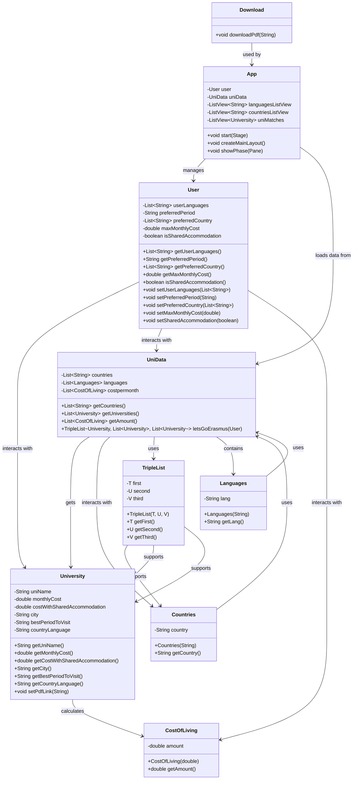

# DMSTPLUS
  Η εφαρμογή DMSTPLUS είναι μια εφαρμογή που υποστηρίζει φοιτητές του τμήματος Διοικητικής Επιστήμης και Τεχνολογίας (DMST) 
  που επιθυμούν να συμμετάσχουν στο πρόγραμμα Erasmus. Ο κύριος στόχος της είναι να διευκολύνει τη διαδικασία επιλογής πανεπιστημίων, 
  δημιουργίας βιογραφικού και υποβολής αίτησης.

# ΑΠΑΙΤΗΣΕΙΣ

Για να εκτελέσετε την εφαρμογή, πρέπει να έχετε εγκατεστημένα τα παρακάτω:

- **Maven**: για τη διαχείριση του έργου και την εκτέλεση του build.
- **JavaFX** : για την εκτέλεση του γραφικού περιβάλλοντος (UI).
- **Java 23 (έκδοση 23.0.1)**: η έκδοση της Java που απαιτείται για την εκτέλεση του προγράμματος.

# ΟΔΗΓΙΕΣ ΜΕΤΑΓΛΩΤΤΙΣΗΣ ΤΟΥ ΠΡΟΓΡΑΜΜΑΤΟΣ

  ΒΗΜΑ 1
    Ανοίξτε το τερματικό Cygwin και πηγαίνετε στον φάκελο του έργου (Maven_Structure_dmstplus) μέσω της εντολής: 
          
    cd /cygdrive/c/Users/dim/JAVA/prog_II_project/Maven_Structure_dmstplus
        
  ΒΗΜΑ 2 
    Καθαρίστε τα προηγούμενα build αρχεία και δημιουργήστε ένα νέο εκτελέσιμο αρχείο μέσω της εντολής: 
    
    mvn clean package

# ΟΔΗΓΙΕΣ ΕΚΤΕΛΕΣΗΣ ΤΟΥ ΠΡΟΓΡΑΜΜΑΤΟΣ

Αφού έχετε πραγματοποιήσει να προηγούμενα βήματα, μπορείτε να εκτελέσετε το πρόγραμμα με δυο εντολές:

  Εντολή 1: 
    
    mvn javafx:run
    
  Εντολή 2:
              
    mvn exec:java

# ΟΔΗΓΙΕΣ ΧΡΗΣΗΣ ΤΟΥ ΠΡΟΓΡΑΜΜΑΤΟΣ

## Let's Start

  Για να ξεκινήσει η διαδικασία εύρεσης των πανεπιστημίων που σας ταιριάζουν πατήστε το κουμπί "Let's Start" και απαντήστε στις ερωτήσεις που θα σας εμφανιστούν. Για 
  παράδειγμα: θα σας ζητηθεί να εκχωρήσετε το ποσό που είστε διατεθιμένοι να δαπανάτε μηνιαία. Στη περίπτωση αυτή θα απαντήσετε αφού πατήσετε το κουμπί "Monthly Grant" 
  και ενημερωθείτε για τη μηνιαία επιχορήγηση που θα λαμβάνετε.

  (ΠΡΟΣΟΧΗ: Όταν σας ζητηθεί σε ερωτήματα να απαντήσετε, επιλέγοντας αντικείμενα λιστών κάντε double click στο τετραγωνάκι του συγκεκριμένου αντικειμένου για να επιβεβαιώσετε την απάντηση σας).

  Αν είστε έτοιμοι να προχωρήσετε στην επόμενη σελίδα πατήστε το κουμπί "Next". Αν θέλετε να πάτε σε προηγούμενη σελίδα πατήστε το κουμπί "Back".

## Menu
  
  Αν είστε έτοιμοι να υποβάλλετε αίτηση τότε πατήστε το κουμπί Menu. Θα σας εμφανιστούν τρία νέα κουμπιά: 
      - Το Build your CV, όπου πατώντας το, σας εμφανίζεται ένας πίνακας με συμβουλές για το πώς να οργανώσετε το βιογραφικό σας (δίνεται επίσης η επιλογή λήψης του           
        αντίστοιχου κειμένου σε μορφή PDF), έτσι ώστε να αυξηθούν οι πιθανότητες να γίνεται δεκτοί 
      - το Erasmus Info, όπου σας παρέχει την δυνατότητα λήψης των απαραίτητων εγγράφων, για την υποβολή της αίτησης σας 
      - και το Apply, που σας κατευθύνει στην ιστοσελίδα της σχολής και συγκεκριμένα στο σημείο που υποβάλλετε την αίτηση σας.


# ΔΟΜΗ ΠΕΡΙΕΧΟΜΕΝΩΝ
  - src/main/java/com/dmstplus: Ο πηγαίος κώδικας της εφαρμογής.
  - src/test/java/com/dmstplus: Κώδικας για δοκιμές (junit tests) για τις αντίστοιχες λειτουργίες.
  - docs/javadoc: Οι τεκμηριώσεις των κλάσεων μέσω Javadoc.
  - resources/PDF: Αρχεία PDF που σχετίζονται με πανεπιστήμια.
  - resources/UniPDFs: Αρχεία PDF με πληροφορίες για πανεπιστήμια.
  - resources/photos: Εικόνες που χρησιμοποιούνται στην εφαρμογή.
  - lib: Βιβλιοθήκες JAR για το JavaFX framework.
  - pom.xml: Διαμόρφωση και εξαρτήσεις για την κατασκευή της εφαρμογής μέσω Maven.
  - target: Φάκελος με το παραγόμενο JAR αρχείο, τα μεταγλωττισμένα αρχεία κλάσεων, και τις αναφορές από τις δοκιμές (surefire-reports).

# ΔΙΑΓΡΑΜΜΑ UML




# ΔΟΜΕΣ ΔΕΔΟΜΕΝΩΝ ΚΑΙ ΑΛΓΟΡΙΘΜΟΙ/ΜΕΘΟΔΟΙ

## Δομές Δεδομένων:
  Η εφαρμογή χρησιμοποιεί κυρίως λίστες ως δομές δεδομένων όπως τις:
  
  - Lists: userslanguages, preferredCountry τύπου String: Χώρες και γλώσσες που γνωρίζει ο χρήστης.
    
  - List: universities τύπου University: Πανεπιστήμια με πληροφορίες όπως κόστος, γλώσσα και περίοδος.
    
  - Lists: languages, countries τύπου Languages και τύπου Countries αντίστοιχα: Γλώσσες και χώρες για τις διαθέσιμες επιλογές.
    
  Ακόμα η εφαρμογή αποτελείται και απο τις δομές δεδομένων:
  
  - TripleList η οποία είναι μια προσαρμοσμένη κλάση που αποθηκεύει τρεις διαφορετικές λίστες.
  
  - και την κλάση User που αποθηκεύει τις προτιμήσεις του χρήστη (γλώσσες, χώρες, κόστος, περίοδος,   
    κτλ.).

## Αλγόριθμοι/Μέθοδοι:
  Η εφαρμογή DMSTPLUS αποτελείται από πολλές μεθόδους, εκ των οποίων οι περισσότερες έχουν μικρή λειτουργική σημασία. 
  Η κύρια μέθοδος της εφαρμογής είναι η letsGoErasmus, η οποία ελέγχει αν τα πανεπιστήμια ταιριάζουν με τις προτιμήσεις του χρήστη
  (χώρα, γλώσσα, κόστος, περίοδος) και κατηγοριοποιεί τα αποτελέσματα σε τρεις λίστες. Στην πρώτη εκχωρούνται τα πανεπιστήμια που
  ταιριάζουν με όλες τις προτιμήσεις του χρήστη, στην δεύτερη εκχωρούνται τα πανεπιστήμια που ταιριάζουν πλήρως, εκτός απο
  την περίοδο και στην τρίτη λίστα εκχωρούνται τα πανεπιστήμια που ταιριάζουν με τις προτιμήσεις του χρήστη και ο χρήστης
  γνωρίζει αγγλικά και όχι την γλώσσα της συγκεκριμένης χώρας. Οι λίστες αυτές δημιουργήθηκαν για να απλοποιηθεί η
  διαδικασία ταξινόμησεις των πανεπιστημίων.

  ### Μέθοδος: letsGoErasmus

  ```java

public TripleList<List<University>, List<University>, List<University>> letsGoErasmus(User user) {
        // Στη λίστα uni_match θα αποθηκεύονται τα πανεπιστήμια που ταιριάζουν με κάθε user
        List<University> uni_match = new ArrayList<>();
        List<University> uni_match_p = new ArrayList<>();
        List<University> uni_match_l = new ArrayList<>();

        for (University university : universities) {
            
            boolean is_it_a_match = true;


            // Εδώ ελέγχουμε αν το συγκεκριμένο πανεπιστήμιο βρίσκεται στη χώρα που επιθυμεί ο user
            if (!(user.getPreferredCountry().contains(university.getCountry()))) {
                is_it_a_match = false;
            }

            if (user.getSharedAccomondation()) {
                // Εδώ ελέγχουμε αν διατίθεται ο user να δαπανά το μηνιαίο μέσο κόστος ζωής (με συγκατοίκηση) της συγκεκριμένης πόλης 
                if ((university.getCostWithSh_Accomondation() == 0.0) || (user.getMaxMonthlyCost() < university.getCostWithSh_Accomondation())) {
                    is_it_a_match = false;
                }
            } else {
                // Εδώ ελέγχουμε αν διατίθεται ο user να δαπανά το μηνιαίο μέσο κόστος ζωής της συγκεκριμένης πόλης 
                if (user.getMaxMonthlyCost() < university.getMonthlyCost()) {
                    is_it_a_match = false;
                }
            }

            if ((is_it_a_match) && (user.getUserslanguages().contains("English")) && !(user.getUserslanguages().contains(university.getCountrysLang()))) {
                    uni_match_l.add(university);
            }
            
                

            // Εδώ ελέγχουμε αν ο user γνωρίζει τη γλώσσα της συγκεκριμένης χώρας
            if (!(user.getUserslanguages().contains(university.getCountrysLang()))) {
                is_it_a_match = false;
            }
            // Τέλος αν το πανεπιστήμιο πληρεί τις προϋποθέσεις του user τότε το αποθηκεύουμε στη λίστα uni_match
            if (is_it_a_match) {
                if (university.getBestPeriodToVisit().equals(user.getPreferredPeriod())) {
                    uni_match.add(university);
                } else {
                    uni_match_p.add(university);
                } 
            }        
            
        }        
        return new TripleList<>(uni_match, uni_match_p, uni_match_l);
    }
  
  ```

# ΑΔΕΙΑ ΑΝΟΙΚΤΟΥ ΚΩΔΙΚΑ:

  Copyright (c) 2024-2025 DMSTPLUS
 
  Licensed under the Apache License, Version 2.0 (the "License");
  you may not use this file except in compliance with the License.
  You may obtain a copy of the License at
 
  [LICENSE](http://www.apache.org/licenses/LICENSE-2.0)


 
  Unless required by applicable law or agreed to in writing, software
  distributed under the License is distributed on an "AS IS" BASIS,
  WITHOUT WARRANTIES OR CONDITIONS OF ANY KIND, either express or implied.
  See the License for the specific language governing permissions and
  limitations under the License.
